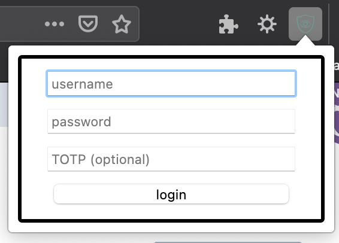
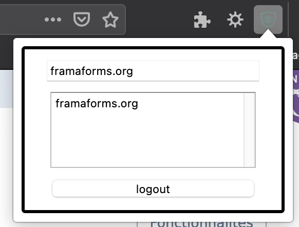

# Secretin add-on

[Secret-in](http://my.secret-in.me) auto completion browser extension.

Using [secretin-lib](https://github.com/secretin/secretin-lib) to interact with [secretin-server](https://github.com/secretin/secretin-server).

⚠️ PoC for the moment ⚠️

## Installation

### Firefox

- Download & Install last [release](https://github.com/H4ckd4ddy/secretin-add-on/releases/latest) in Firefox (.xpi file)
- Change Secretin API URL in add-on settings if needed

### Safari

- Enable unsigned add-on in Safari (I don't have the Apple dev license)
- Download last [release](https://github.com/H4ckd4ddy/secretin-add-on/releases/latest) (.app file)
- Place .app file in your applications folder
- Open app and enable add-on in Safari
- Change Secretin API URL in add-on settings if needed

### Chrome

- Download last [release](https://github.com/H4ckd4ddy/secretin-add-on/releases/latest) (.crx file) 
- Open [chrome://extensions/](chrome://extensions/) in Chrome
- Tick "Enable developer" (I won't pay Google dev account)
- Drag & drop .crx file, then confirm
- Change Secretin API URL in add-on settings if needed

## How to use

Unlock :

- Click on extension icon
- Complete login form, submit and wait...

Auto completion :

- On a login page, click on extension icon
- The current URL appear as default search keyword
- Double click on wanted secret name
- The login form is completed

## Screenshot

Minimalist UI

